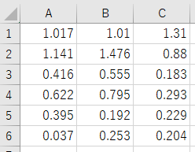

# Easy Tukey

tukeyの多重検定を簡単に使うためのRプログラムです。
例えば、以下のようなデータがあったとします。

| condition | rep 1 | rep2  | rep3  |
| :-------: | ----- | ----- | ----- |
|    c1     | 1.017 | 1.01  | 1.31  |
|    c2     | 1.141 | 1.476 | 0.88  |
|    c3     | 0.416 | 0.555 | 0.183 |
|    c4     | 0.622 | 0.795 | 0.293 |
|    c5     | 0.395 | 0.192 | 0.229 |
|    c6     | 0.037 | 0.253 | 0.204 |

下のようなファイルをエクセルで作成し、csv(UTF区切り)で保存してください。




## Usage

Rを検定したいファイルのある場所で起動する、もしくは`setwd`を使う、絶対パスを入れるなどしてファイルを指定してください。

```r
source(easyTukey.R)

tukeyFromFile("test.csv", sep=",")
tukeyFromFiles(".", pattern=".csv", sep=",")
```

- tukeyFromFile関数は、一つのファイルに対して検定を実行します。
- tukeyFromFiles関数は、指定したディレクトリにある指定された拡張子のファイルすべてに対して検定を実行します。

```bash
	 Simultaneous Tests for General Linear Hypotheses

Multiple Comparisons of Means: Tukey Contrasts


Fit: aov(formula = data ~ group, data = aovData)

Linear Hypotheses:
           Estimate Std. Error t value Pr(>|t|)    
2 - 1 == 0  0.07100    0.12024   0.590  0.99041    
3 - 1 == 0 -0.69600    0.12024  -5.788  < 0.001 ***
4 - 1 == 0 -0.50550    0.12024  -4.204  0.00598 ** 
5 - 1 == 0 -0.78575    0.12024  -6.535  < 0.001 ***
6 - 1 == 0 -0.95575    0.12024  -7.948  < 0.001 ***
3 - 2 == 0 -0.76700    0.12024  -6.379  < 0.001 ***
4 - 2 == 0 -0.57650    0.12024  -4.794  0.00169 ** 
5 - 2 == 0 -0.85675    0.12024  -7.125  < 0.001 ***
6 - 2 == 0 -1.02675    0.12024  -8.539  < 0.001 ***
4 - 3 == 0  0.19050    0.12024   1.584  0.61831    
5 - 3 == 0 -0.08975    0.12024  -0.746  0.97303    
6 - 3 == 0 -0.25975    0.12024  -2.160  0.30256    
5 - 4 == 0 -0.28025    0.12024  -2.331  0.23248    
6 - 4 == 0 -0.45025    0.12024  -3.744  0.01584 *  
6 - 5 == 0 -0.17000    0.12024  -1.414  0.71873    
---
Signif. codes:  0 ‘***’ 0.001 ‘**’ 0.01 ‘*’ 0.05 ‘.’ 0.1 ‘ ’ 1
(Adjusted p values reported -- single-step method)

   1    2    3    4    5    6 
 "c"  "c" "ab"  "b" "ab"  "a" 
```
